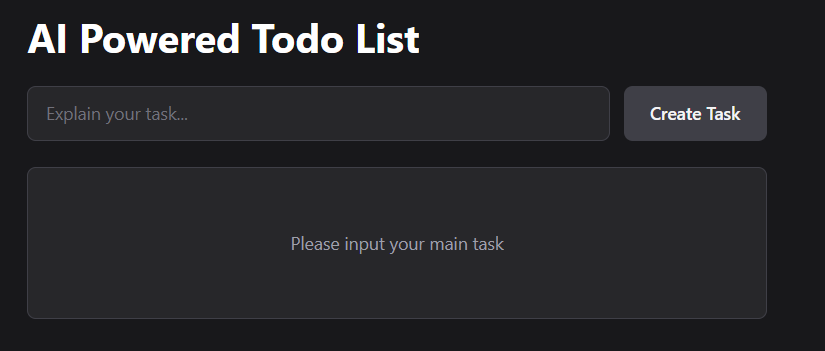
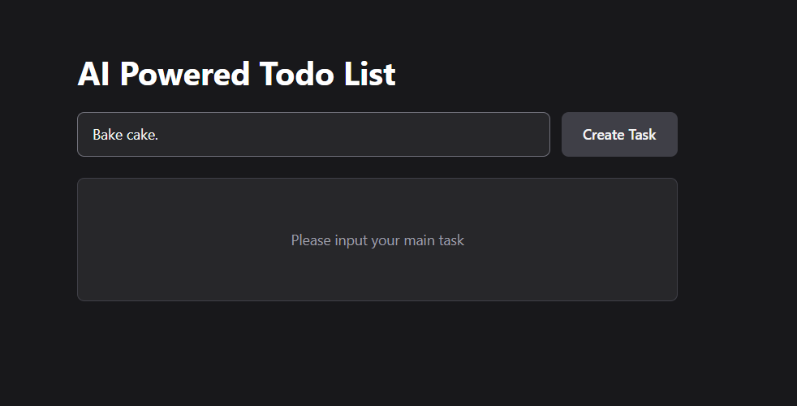
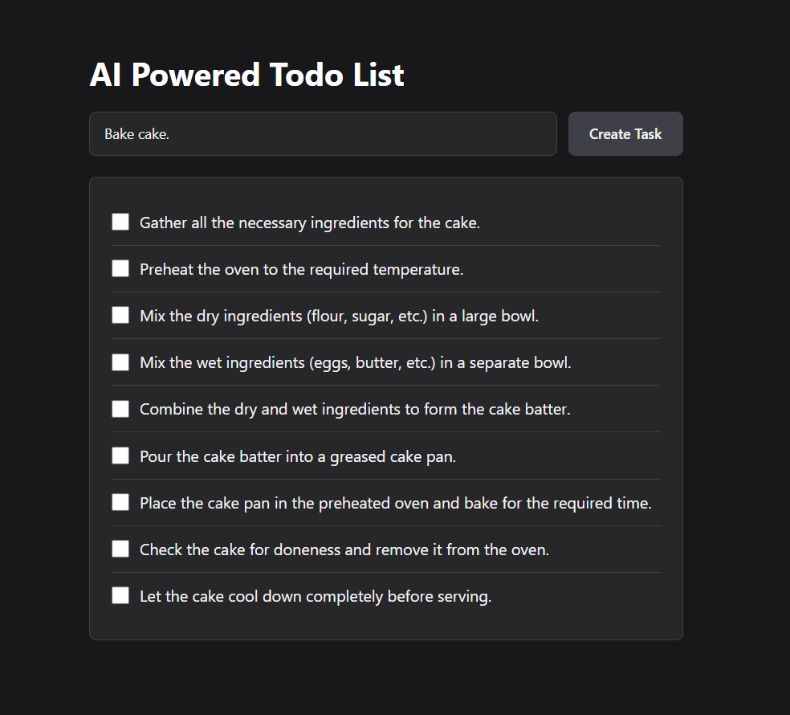
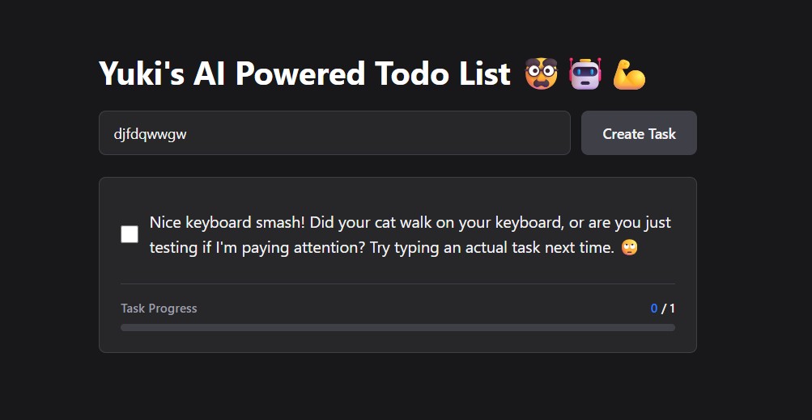
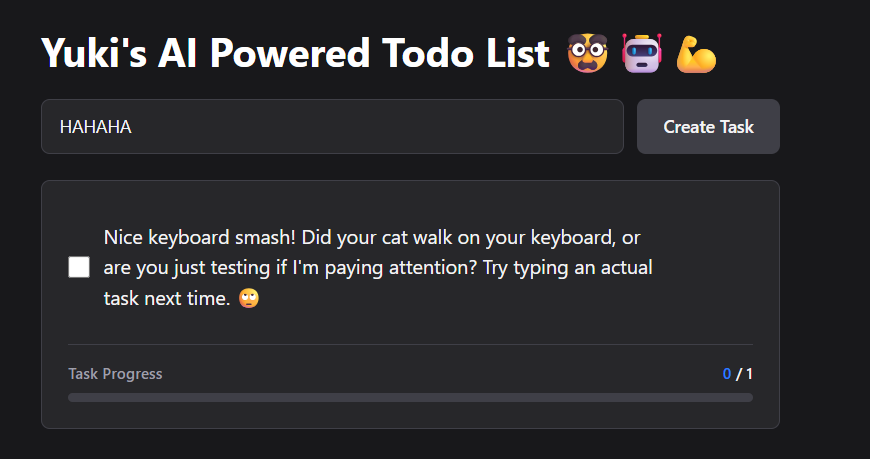
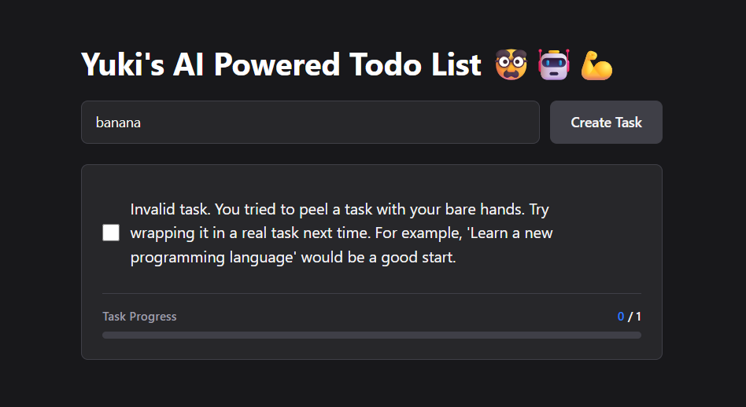

# 🧠 AI-Powered To-Do Generator

Turn overwhelming tasks into clear, doable steps.

This project is an **AI-powered to-do list** designed especially for people with **ADHD** (and anyone who struggles with task paralysis).  
You type **one main task**, and the AI automatically breaks it down into **small, actionable subtasks**.

---

## ✨ Why This Exists

Big tasks can feel impossible to start.

Instead of:
> “I need to clean the bathroom.”

You get:
- Gather cleaning supplies  
- Clear clutter  
- Clean sink and toilet  
- Sweep and mop the floor  
- Disinfect high-touch areas  

Small wins → momentum → task completed.

---

## 🧩 How It Works

1. Enter a **main task** (e.g. *“I want to clean the bathroom”*)
2. Click **Create Task**
3. AI generates **bite-sized steps**
4. Check off tasks one by one ✅

No overthinking. Just start.

---

## 🎯 Who This Is For

- People with **ADHD**
- Anyone who struggles with **starting tasks**
- Students, professionals, creatives
- Developers exploring **AI task decomposition**

---

## 🛠️ Tech Overview (Simple)

- AI breaks down tasks using natural language understanding
- Frontend displays clean, distraction-free UI
- Focused on **clarity, not complexity**

> The goal is not productivity overload — it’s **mental relief**.

---

## 🌱 Future Ideas

- Task difficulty levels
- Time estimates per subtask
- Voice input
- Save & resume tasks
- ADHD-friendly reminders

---

## 💡 Philosophy

> “Don’t plan your whole life.  
> Just do the next smallest thing.”

---

## Captures

### Initial Screen

### Input Text

### Result

### EDGE CASE 1: Gibberish Input

### EDGE CASE 2: Nonsense Input

